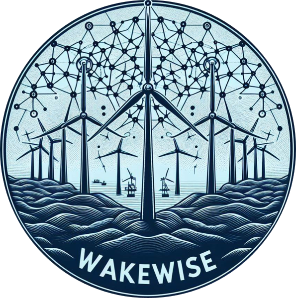

  

# WakeWISE
WakeWISE (Wakesteering Windfarm Interactive Simulation Environment) is a fast and efficient simulation environment for reinforcement learning applications. At the heart of the environment sits a Graph Neural Network surrogate model, imitating the extensive calculations that are normally required to model wake effects in wind farms and the local wake-affected power and loads of all turbines involved. This surrogate can be found in [this branch](https://github.com/gduthe/windfarm-gnn/tree/yaw-control-extension) of the WindfarmGNN repo. The environment keeps track of power production, as well as fatigue degradation/accumulation, as a result of wake steering control. As such, profits through energy production and costs through maintenance are modelled to allow for revenue optimisation techniques. Additionally, it contains several modules to sample realistic wind conditions and electricity prices. The environment is implemented according to the Gymnasium API, using 10-minute timesteps.

## Fatigue
In WakeWISE, fatigue is modelled according to Palmgren-Miner's linear damage accumulation rule. The GNN surrogate provides, given the wind conditions and yawing actions, the Damage Equivalent Load (DEL) of several locations within each turbine. This DEL is a measure of the magnitude of the cyclic fatigue loads, and allows us to calculate the damage increments for each component on each turbine. Next, using fatigue curves fitted using gradient descent methods, the added damage of the fatigue loads during each timestep are added up. The maintenance model will calculate the maintenance cost based on either the increment in damage, or the absolute value of accumulated damage, based on which maintenance model is chosen. Note that the degradation model and maintenance model are fully customisable, and can be replaced by any custom module. Two versions of fatigue models are implemented: deterministic and stochastic. The deterministic module has deterministic fatigue curve parameters, whereas the stochastic module has stochastic curve parameters which are sampled.

## Wind sampling
Wind conditions are sampled according to a Markov Chain model, fitted on a dataset of the Anholt wind farm. Both wind direction and wind speed are sampled using this Markov Chain process, conditioned on previous states and in-simulation calendar time. Of course, these modules are fully customisable and can be replaced as desired. Turbulence intensity and shear exponent are sampled according to uniform distributions based on the newly sampled wind speed. Most modules provide temporally coherent series, with seasonal effects.

## Electricity Price Sampling
Electricity prices are inherently part of the trade-off between turbine usage and power optimisation. As such, a custom electricity price sampling module is included. It samples from a large matrix, the electricity price, indexed by month of the year and hour of the day. This way, seasonal and hourly effects are included in the environment, which coincide with the seasonal effects experienced by the wind condition sampling module.

## Wrappers
A bunch of wrappers are provided which can adjust the environment in various ways. For example, the environment can be made to be fully observable (e.g. all states are observed in the observation space), or the observation can be encoded onto a graph. Furthermore, there are wrappers for observation / action space normalisation, reward value scaling and baseline removal. The latter jointly calculates the reward for both the 'true' actions, as well as a 'baseline' action, which by default is the zero-yaw policy. Next, it removes the reward obtained by the default policy, from the reward obtained by the 'true' policy. This yields a more stable reward signal with less variance in it, which (from my experience) was essential to making RL learn effectively.

## Final Remarks
I will update this README sooner or later when I have a bit more time on my hands. For now, if any other questions arise, feel free to e-mail me at b.d.vanberkel@student.tudelft.nl